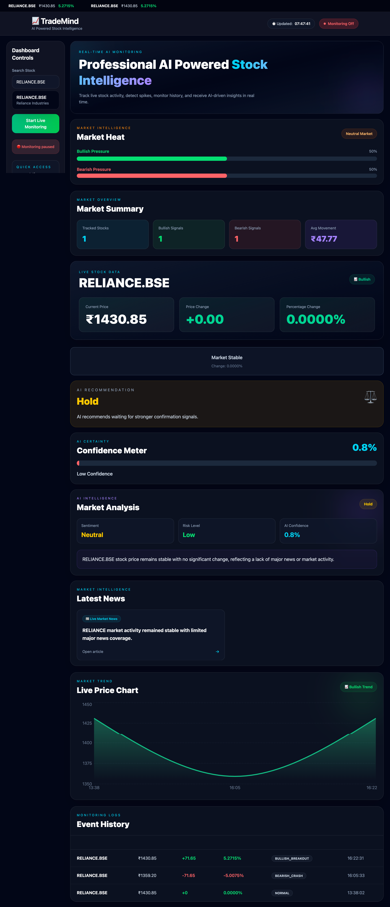

# 🚀 TradeMind — AI-Powered Fintech Intelligence Platform

TradeMind is a production-oriented AI-powered fintech intelligence platform built to monitor realtime stock movements, detect unusual market behavior, correlate financial news, and generate intelligent market insights.

The project evolved from a simple stock dashboard into a cloud-deployed SaaS-style architecture using:

* React + TypeScript
* Node.js + Express
* Prisma ORM
* PostgreSQL
* Realtime polling systems
* AI-generated explanations
* Cloud deployment infrastructure

---

# 🌐 Live Deployment

## Frontend

 
https://YOUR_VERCEL_URL.vercel.app
 

## Backend API

 
https://trademind-ai-y0kk.onrender.com/api/stocks
 

---

# 📸 Project Preview

 
frontend/public/screenshots/
 

Recommended screenshots:

* Dashboard overview
* Market Heat system
* Watchlist system
* AI insight panel
* History table
* Event detection alerts

---

# 🎯 Project Vision

Traditional trading dashboards mostly display raw numbers without context.

TradeMind was designed to solve this problem by combining:

 
Realtime Stock Data
+
Event Detection
+
News Correlation
+
AI Intelligence
 

into a unified architecture.

The long-term goal is to evolve TradeMind into:

 
AI-powered market intelligence SaaS platform
 

capable of:

* realtime market monitoring
* intelligent event analysis
* portfolio intelligence
* AI trading insights
* advanced analytics
* multi-stock monitoring

---

# ⚡ Core Features

## 📈 Realtime Stock Monitoring

* realtime polling architecture
* live stock price updates
* dynamic symbol switching
* stock-specific history tracking

---

## 🧠 AI Insight Engine

* AI-generated market explanations
* contextual event summaries
* confidence scoring architecture
* sentiment-oriented insight generation

---

## 🚨 Event Detection System

TradeMind detects:

* unusual spikes
* rapid drops
* significant market movement

using custom detection logic.

---

## 🔥 Market Heat System

Visualizes:

* bullish pressure
* bearish pressure
* market mood

using realtime history analysis.

---

## 📰 News Correlation

* stock-related news fetching
* event + news synchronization
* contextual market intelligence

---

## ⭐ Watchlist Architecture

* localStorage persistence
* active symbol management
* realtime dashboard switching

---

## ☁️ Cloud Deployment

Production infrastructure includes:

* Vercel frontend deployment
* Render backend deployment
* Neon PostgreSQL cloud database
* GitHub CI/CD workflow

---

# 🏗️ System Architecture

 
Frontend (React + TypeScript)
          ↓
Backend API (Express)
          ↓
--------------------------------
| Stock Service               |
| Detection Engine            |
| News Service                |
| AI Service                  |
--------------------------------
          ↓
Prisma ORM
          ↓
Neon PostgreSQL
 

---

# 🧩 Tech Stack

## Frontend

* React
* TypeScript
* Vite
* Tailwind CSS
* Custom Hooks

## Backend

* Node.js
* Express.js
* Prisma ORM

## Database

* PostgreSQL
* Neon PostgreSQL

## APIs

* Alpha Vantage
* GNews API

## Deployment

* Vercel
* Render

---

# 📂 Project Structure

 
TradeMind/
│
├── backend/
│   ├── prisma/
│   └── src/
│       ├── controllers/
│       ├── services/
│       ├── routes/
│       ├── utils/
│       └── config/
│
├── frontend/
│   └── src/
│       ├── components/
│       ├── hooks/
│       ├── pages/
│       ├── services/
│       └── types/
│
└── docs/
 

---

# 🧠 Important Engineering Decisions

## 1. Symbol-Specific History Architecture

Initial architecture returned:

 
global latest rows
 

which caused:

* mixed stock history
* invalid chart rendering
* corrupted dashboard synchronization

Final architecture:

 
/history?symbol=AAPL
 

This stabilized:

* chart rendering
* history tracking
* dashboard synchronization

---

## 2. Query State vs Confirmed State Refactor

A major realtime bug occurred because API requests triggered while typing.

Problem:

 
input onChange → API request → DB write
 

This created:

* corrupted symbols
* invalid DB rows
* stale UI state

Final fix:

 
query state
vs
confirmed symbol state
 

This became one of the most important architecture refactors in the project.

---

## 3. Environment-Aware API Infrastructure

Previous architecture:

 ts
const BASE_URL = "http://localhost:5001/api/stocks";
 

Final architecture:

 ts
const BASE_URL =
  import.meta.env.VITE_API_URL ||
  "http://localhost:5001/api/stocks";
 

This enabled:

* production deployment
* environment separation
* cloud portability

---

# 🚀 Local Development Setup

## 1. Clone Repository

 bash
git clone https://github.com/AniketSain1/trademind-ai.git
 

---

## 2. Backend Setup

 bash
cd backend
npm install
 

Create:

 
backend/.env
 

Example:

 env
DATABASE_URL=YOUR_DATABASE_URL
ALPHA_VANTAGE_API_KEY=YOUR_API_KEY
GNEWS_API_KEY=YOUR_API_KEY
GROQ_API_KEY=YOUR_API_KEY
PORT=5001
 

Run:

 bash
npx prisma generate
npx prisma db push
npm run dev
 

---

## 3. Frontend Setup

 bash
cd frontend
npm install
 

Create:

 
frontend/.env
 

Example:

 env
VITE_API_URL=http://localhost:5001/api/stocks
 

Run:

 bash
npm run dev
 

---

# ☁️ Production Deployment

## Frontend

* Vercel

## Backend

* Render

## Database

* Neon PostgreSQL

---

# 🔥 Production Challenges Solved

## TypeScript Production Build Failures

Error:

 
TS6133 variable declared but never read
 

Fix:

* removed unused variables
* stabilized MarketHeat architecture

---

## Dynamic Port Handling

Problem:

 js
const PORT = 5001;
 

Fix:

 js
const PORT = process.env.PORT || 5001;
 

---

## Realtime Symbol Corruption

Cause:

 
typing triggered realtime API requests
 

Fix:

 
query state vs confirmed symbol state
 

---

# 📚 Documentation

Project documentation lives inside:

 
docs/
 

Includes:

* engineering case study
* system design
* deployment guide
* roadmap
* engineering logs

---

# 🛣️ Roadmap

## Planned Features

* realtime chart systems
* Framer Motion animations
* toast notification architecture
* authentication system
* portfolio tracking
* WebSocket infrastructure
* Redis caching
* BullMQ queues
* AI trading intelligence
* multi-stock monitoring

---

# 🎯 Key Engineering Learnings

This project introduced production-level concepts including:

* realtime architecture
* frontend/backend synchronization
* Prisma ORM workflows
* deployment infrastructure
* environment variable management
* TypeScript production debugging
* cloud database architecture
* scalable frontend design

---

# 📌 Final Evolution

TradeMind evolved from:

 
basic stock dashboard
 

into:

 
production-oriented AI-powered fintech intelligence platform
 

focused on:

* realtime infrastructure
* intelligent event systems
* scalable architecture
* SaaS engineering principles
* production deployment workflows
